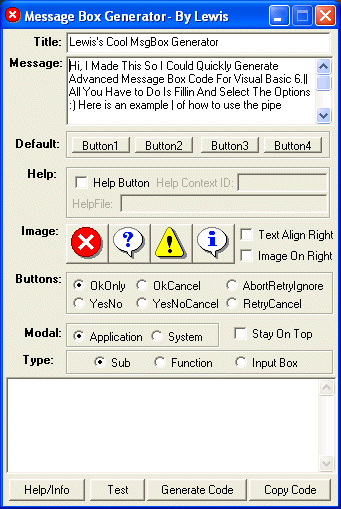



## Msgbox Gen

### Description

YAMM! (yet another msgbox maker) before you snort in disgust, take a look! Ability to use every available feature of the msbox function, can do inputbox, or msgbox sub or msgbox function. Auto replaces quotes with Chr(34) and has ability to auto add linebreaks (by using the pipe symbol). Calculates your selections on the fly into a single number for the image and button options. Has complete testing button of all functions. Even shows you the results of your code! Now that your sold, download the last msgbox maker you'll ever need...
 
### More Info
 

             |
---                |---
**Submitted On**   |2004-08-30 03:14:02
**By**             |[Deth](https://github.com/Planet-Source-Code/PSCIndex/blob/master/ByAuthor/deth.md)
**Level**          |Beginner
**User Rating**    |5.0 (25 globes from 5 users)
**Compatibility**  |VB 6\.0
**Category**       |[VB function enhancement](https://github.com/Planet-Source-Code/PSCIndex/blob/master/ByCategory/vb-function-enhancement__1-25.md)
**World**          |[Visual Basic](https://github.com/Planet-Source-Code/PSCIndex/blob/master/ByWorld/visual-basic.md)
**Archive File**   |[Msgbox\_Gen1787398302004\.zip](https://github.com/Planet-Source-Code/deth-msgbox-gen__1-55894/archive/master.zip)

